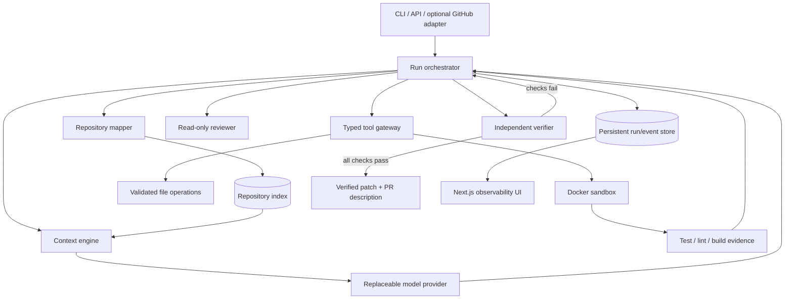
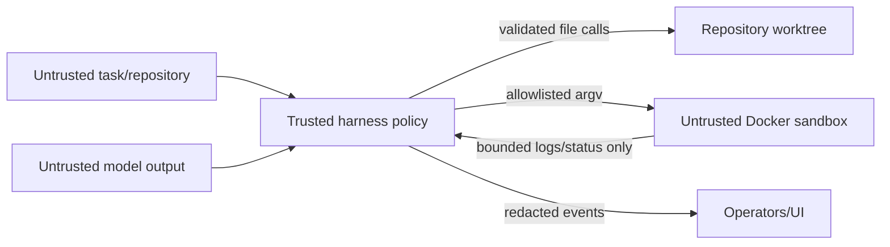

# Architecture

## Model/harness boundary

Providers receive bounded prompts and return typed decisions. They may propose a plan, a file operation or concise review findings. The harness alone owns repository discovery, context selection, tool execution, state transitions, budgets, retries, stopping, event storage and completion. Provider adapters are therefore replaceable and deliberately unaware of Docker, Git or persistence details.

## Components

- **Repository mapper** performs bounded static inspection and stores paths, hashes, language, imports, symbols and role hints. Git metadata is obtained through fixed Git argv, never model-generated commands.
- **Context engine** scores index entries against task terms, relationship hints, changed paths and recent failures. It packs excerpts into a token budget and logs hashes plus line ranges so prompt inputs are auditable.
- **Orchestrator** is the sole state-transition authority. Each transition records what changed, what failed, available evidence and the next action.
- **Tool gateway** validates typed requests, paths and budgets. File mutations are atomic and constrained to the target repository.
- **Sandbox** maps named operations to configured argv and runs them in a locked-down Docker container. There is no arbitrary command tool.
- **Reviewer** sees requirements and the diff, is read-only, and returns structured findings.
- **Verifier** evaluates fresh sandbox evidence and path/file policies. It does not consume implementation-agent rationales.
- **Run store** persists state snapshots and append-only events. The local implementation supports SQLite for zero-setup CLI use and PostgreSQL through the deployment stack.
- **UI** renders states, selected context, tool calls, evidence, changes and findings; it never requests or displays hidden reasoning.

## Trust boundaries

See `docs/ARCHITECTURE.md`, `docs/SECURITY.md`, and `docs/SANDBOX.md` for implementation details.
