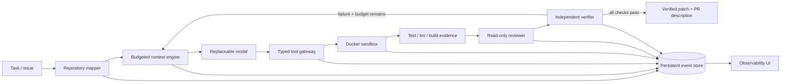
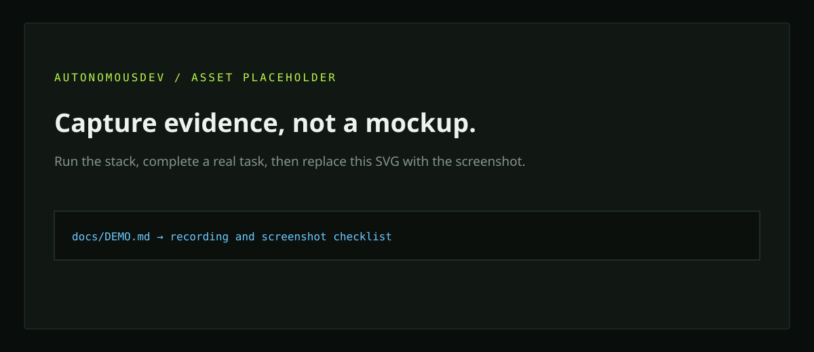

# AutonomousDev Harness

**The engineering control plane around autonomous coding agents.** AutonomousDev turns a repository and an issue into a bounded, observable modify–test–repair loop whose exit condition is machine evidence—not a model saying “done.”

[](https://github.com/hello-harishkumartn/autonomous-agent-harness/actions/workflows/ci.yml)
[](LICENSE)

> Project status: working vertical-slice implementation, pre-1.0. The backend suite (14 tests), static analysis, frontend production build, and dependency audit pass. Docker and a configured model provider were unavailable locally, so no agent benchmark score is claimed.

## Problem

A capable model is not an autonomous engineering system. Reliable repository work also needs context selection, safe tools, isolated execution, persistent state, retry policy, independent review, measurable budgets, and deterministic completion checks. AutonomousDev owns those responsibilities while keeping the model replaceable.

## Architecture



The **model** proposes plans and typed actions. The **harness** owns discovery, context, tools, state, execution, sandbox policy, review boundaries, verification, budgets, retries, stopping and telemetry.

## Demo

```console
$ adev run ./repo --task "Add rate limiting to the login API" --provider gemini
{
  "state": "COMPLETE",
  "outcome": "VERIFIED_COMPLETE",
  "changed_files": ["src/auth/login.py", "tests/test_login.py"]
}

$ adev status 6b7e0f83fd21 --events
$ adev eval --configuration simple --configuration context --configuration full
```

The dashboard at `http://localhost:3000` visualizes the state loop, exact selected context, plan, changed files, controlled tool calls, sandbox evidence, repair attempts, findings and verification. It shows concise action rationale and evidence, never hidden chain-of-thought.



## Benchmark results

The repository includes **30 deterministic tasks** and a three-configuration evaluator. Results are generated from raw run records; they are never hand-edited.

| Configuration | Tasks attempted | pass@1 | Eventual completion | Status |
|---|---:|---:|---:|---|
| Simple coding agent | — | — | — | Not run: Docker/provider unavailable |
| + context engine | — | — | — | Not run: Docker/provider unavailable |
| Full harness | — | — | — | Not run: Docker/provider unavailable |

Run `adev eval` with `ADEV_EVAL_PROVIDER` set to generate timestamped JSON under `benchmark/results/`. See [evaluation methodology](docs/EVALUATION.md) and [benchmark design](docs/BENCHMARK.md).

## How the harness works

1. The mapper builds a lightweight index of paths, language, symbols, imports, tests, manifests, configuration and recent history. Whole repositories are never placed in prompts.
2. The context engine ranks and deduplicates excerpts, packs them to a token budget, refreshes after changes, and logs the exact packet.
3. The orchestrator validates model JSON and dispatches only named tools. There is no model-facing shell.
4. Generated code runs only through Docker with network disabled, resource limits, a read-only container root and bounded output/time.
5. Failures become evidence for the next bounded repair. Duplicate patches, repeated failures, stagnation and budget exhaustion escalate.
6. A read-only reviewer inspects requirements and diff. The verifier separately reruns configured checks and change policy.
7. Only all-green machine checks produce `VERIFIED_COMPLETE`.

## Run locally

Prerequisites: Docker Engine with Compose v2. The default `gemini-3.7-flash` is free-tier eligible; a Gemini API key is optional if using Ollama, and `--model` can override the default.

```bash
# Build pinned-purpose sandbox images. Generated code never runs in the API image.
docker build -f sandbox/python.Dockerfile -t autonomousdev-python-sandbox:0.1 .
docker build -f sandbox/node.Dockerfile -t autonomousdev-node-sandbox:0.1 .

# CLI development install
python -m venv .venv
. .venv/bin/activate
pip install -e '.[dev]'
export GEMINI_API_KEY='...'
adev run ./path/to/repo --task 'Fix the failing pagination boundary test'

# Or local Ollama
adev run ./path/to/repo --task 'Add request validation' --provider ollama
```

Full stack:

```bash
export GEMINI_API_KEY='...'
export ADEV_REPOSITORY_ROOT="$PWD/benchmark/workspaces"
export DOCKER_GID="$(stat -c '%g' /var/run/docker.sock)"  # Linux
docker compose up --build
```

The CLI works without the frontend or PostgreSQL and persists atomically to `.adev-data`. Basic operation never requires GitHub. Optional GitHub automation is an adapter boundary and never pushes without explicit credentials.

## Security posture

Repositories, task text, generated code and model output are untrusted. Paths are canonicalized, symlink escape is rejected, secret-like files are protected, commands are allowlisted, host environment is not forwarded, and sandbox networking defaults to `none`. Mounting a Docker socket grants the API powerful host capabilities; the Compose topology is for local development, not a multi-tenant deployment. Use an isolated remote sandbox service in production. Read the [threat model](docs/SECURITY.md).

## Project map

```text
src/autonomousdev/   orchestration, context, tools, sandbox, providers, API/CLI
web/                 Next.js observability dashboard
benchmark/           30-task manifest, fixtures, hidden acceptance tests, evaluator output
sandbox/             purpose-built execution images
tests/               unit and integration tests
docs/                design, threat model, evaluation, demo and portfolio notes
```

## Documentation

- [Architecture](docs/ARCHITECTURE.md) · [Harness engineering](docs/HARNESS_ENGINEERING.md) · [Loop engineering](docs/LOOP_ENGINEERING.md)
- [Context engineering](docs/CONTEXT_ENGINEERING.md) · [Sandbox](docs/SANDBOX.md) · [Security](docs/SECURITY.md)
- [Evaluation](docs/EVALUATION.md) · [Benchmark](docs/BENCHMARK.md) · [Demo](docs/DEMO.md) · [Resume notes](docs/RESUME.md)

MIT licensed. Contributions should preserve the model/harness boundary and add evidence for behavioral claims.
