# Loop engineering

```mermaid
stateDiagram-v2
  [*] --> DISCOVER
  DISCOVER --> PLAN
  PLAN --> IMPLEMENT
  IMPLEMENT --> TEST
  TEST --> ANALYZE_FAILURE: failed evidence
  ANALYZE_FAILURE --> REPAIR
  REPAIR --> TEST
  TEST --> REVIEW: tests pass
  REVIEW --> REPAIR: blocking finding
  REVIEW --> VERIFY: review clear
  VERIFY --> ANALYZE_FAILURE: acceptance failure
  VERIFY --> COMPLETE: every check passes
  DISCOVER --> ESCALATE: policy/budget/infrastructure
  PLAN --> ESCALATE
  IMPLEMENT --> ESCALATE
  TEST --> ESCALATE
  REPAIR --> ESCALATE
  REVIEW --> ESCALATE
  VERIFY --> ESCALATE
```

Every state transition is validated against an explicit transition table and persisted. Events answer what changed, what failed, what evidence exists and what happens next.

Failure output is bounded, normalized and hashed. The next context packet includes recent failure evidence and changed paths. Repeated failure fingerprints, duplicate patch hashes, empty diffs, attempt count, tool count, tokens and the UTC deadline all provide non-model stopping signals.

`COMPLETE` is internal state; the public successful outcome is `VERIFIED_COMPLETE`. It is assigned only after the verifier passes path authorization, required-file presence, blocking-review status and fresh required sandbox commands. Escalation records a specific reason and preserves the worktree for an operator.
